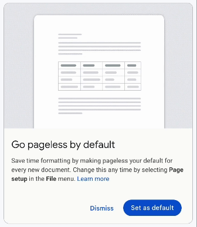

# Google Pageless

I saw this animation when starting a new Google Doc. The Google animation caught my eye as a great way to inform users of a feature that they may want to enable by default. I wanted to make this as an HTML/CSS widget that could be used for the same purpose. Compelling as a React component as well, so that the messaging and call to action can be dynamic. For instance, there is a variation of this UI after accepting the default and returning to a new Google Doc. In either case, there is a learn more link for users that want complete information regarding the feature being presented.
